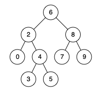

## 二叉搜索树的最近公共祖先（简单）

> **题目：**
>
> 给定一个二叉搜索树, 找到该树中两个指定节点的最近公共祖先。
>
> 百度百科中最近公共祖先的定义为：“对于有根树 T 的两个结点 p、q，最近公共祖先表示为一个结点 x，满足 x 是 p、q 的祖先且 x 的深度尽可能大（一个节点也可以是它自己的祖先）。”
>
> 例如，给定如下二叉搜索树:  root = [6,2,8,0,4,7,9,null,null,3,5]
>
> 
>
> **示例1：**
>
> 输入: root = [6,2,8,0,4,7,9,null,null,3,5], p = 2, q = 8
> 输出: 6 
> 解释: 节点 2 和节点 8 的最近公共祖先是 6。
>
> **示例2：**
>
> 输入: root = [6,2,8,0,4,7,9,null,null,3,5], p = 2, q = 4
> 输出: 2
> 解释: 节点 2 和节点 4 的最近公共祖先是 2, 因为根据定义最近公共祖先节点可以为节点本身。
>
> **说明：**
>
> 所有节点的值都是唯一的。
> p、q 为不同节点且均存在于给定的二叉搜索树中。

9:15~10:15

## 解答：

#### 分析：

​	题目说明了给定的是==二叉搜索树==，因此要注意二叉搜索树的一些性质。

​	二叉树的性质中，左子树的值一定小于右子树的值。

​	p,q两结点的位置有两种情况：

​		（1）左+右或左+根或右+根；

​		（2）都左

​		（3）都右

​	p,q的值，小的赋给min，大的赋给max。若当前根节点在min和max之间，则p,q结点位置是情况1，那么当前结点就是他们的公共最近祖先；若当前根节点大于max，则说明p,q结点位置是情况2，那么继续再左子树中找；若当前根节点小于min，则说明p,q结点位置是情况3，那么继续再右子树中找。

#### 实现：

```java
/**
 * Definition for a binary tree node.
 * public class TreeNode {
 *     int val;
 *     TreeNode left;
 *     TreeNode right;
 *     TreeNode(int x) { val = x; }
 * }
 */
class Solution {
    public TreeNode lowestCommonAncestor(TreeNode root, TreeNode p, TreeNode q) {
        int min = p.val;
        int max = q.val;
        if(min > max){ //让qVal存较大的值
            int temp = max;
            max = min;
            min = temp;
        }
        return getCA(root, min, max);
        
    }
    public TreeNode getCA(TreeNode root, int min, int max){
        if(root == null || (root.val >= min && root.val <= max) ){
            return root;
        }
        if(root.val > max){
            return getCA(root.left, min, max);
        }
        return getCA(root.right, min, max);
    }
}
```

执行用时 :10 ms, 在所有Java提交中击败了88.10%的用户

内存消耗 :40.6 MB, 在所有Java提交中击败了28.00%的用户

时间复杂度：O（h） h是深度

空间复杂度：O（1）